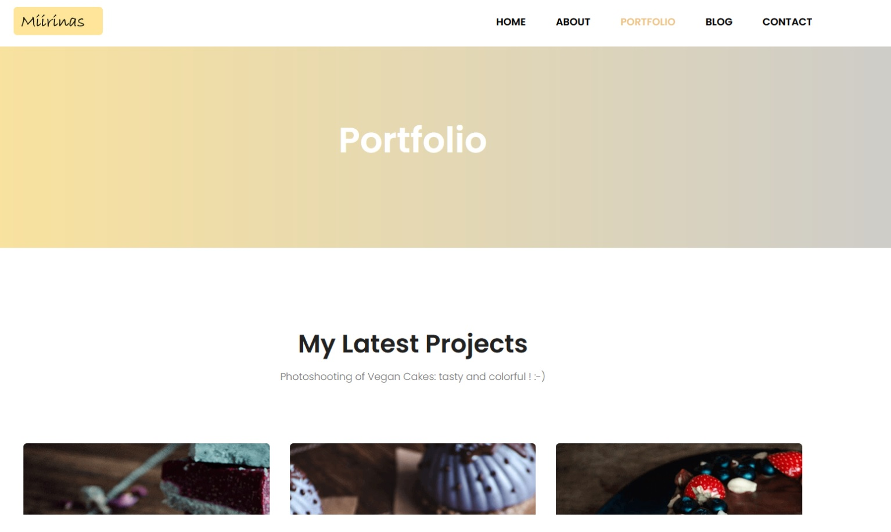

# Project of a website for a Photographer

Project for a fake photographer.

Built in HTML/CCS/Vanilla JS, adapted from a work given for the course of "Creation of static websites" given by M. Evrard from the Institut Saint-Laurent (Certificate in Web-Dev) 